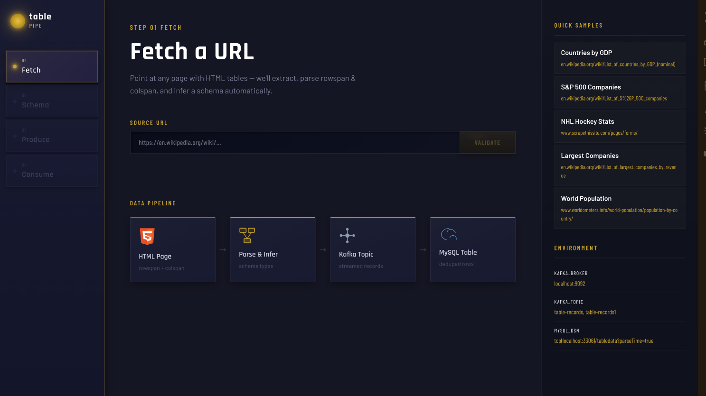
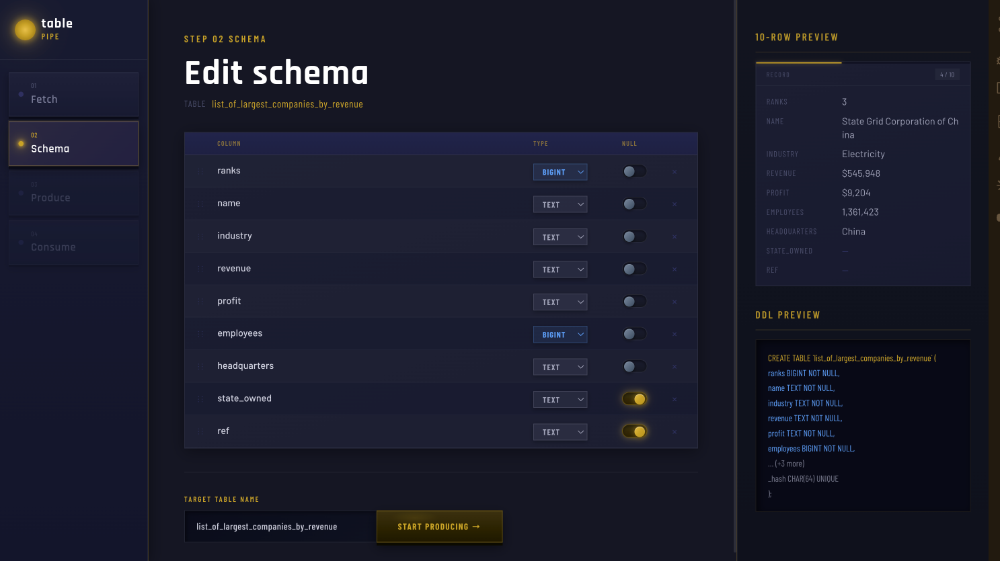
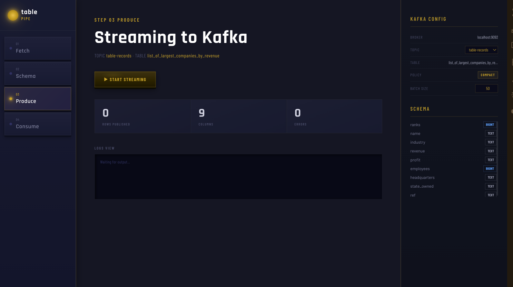
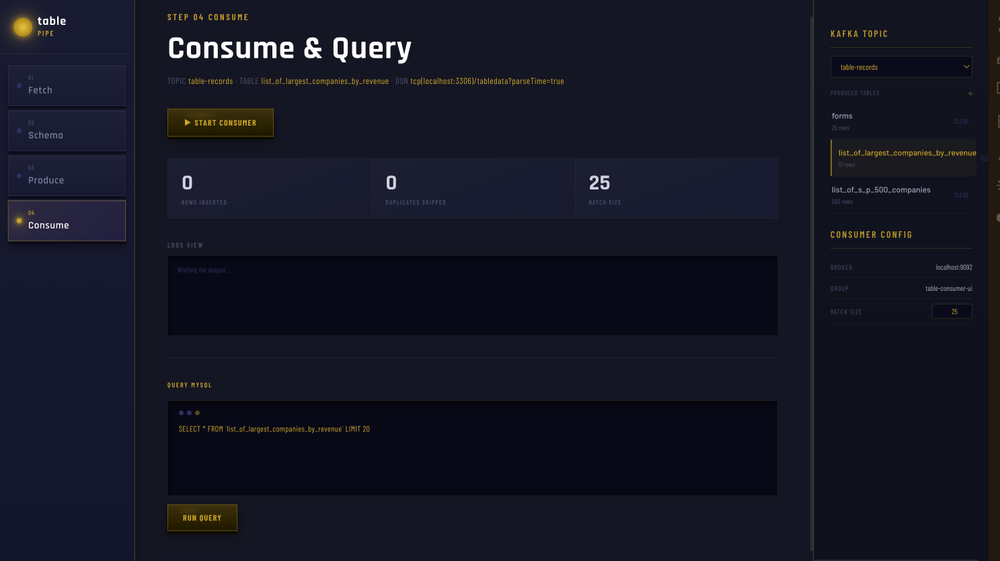

# table pipe

Point at any webpage with HTML tables. table pipe extracts, streams, and stores the data into MySQL through Kafka — no config files, no boilerplate.

## Tech Stack

| Layer | Technology |
|---|---|
| Backend | Go 1.21 |
| Streaming | Apache Kafka (kafka-go) |
| Database | MySQL 8.0 (go-sql-driver) |
| Frontend | React 19, Vite 8, React Router 7 |
| Styling | Tailwind CSS 4 |
| Infrastructure | Docker Compose |

## Pipeline

### Step 1 - Fetch



- Paste any URL containing HTML tables and validate it in one click
- Automatic rowspan and colspan parsing for complex table layouts
- Schema preview with inferred column types shown immediately after validation
- Quick samples panel with preloaded URLs (Wikipedia, NHL stats, S&P 500, world population)
- Environment panel shows live Kafka broker, topic, and MySQL DSN

### Step 2 - Schema



- Edit column names, types (TEXT, BIGINT, DOUBLE, DATE), and nullability before producing
- Live 10-row data preview with paginated record navigation
- Generated DDL shown in real time alongside schema editing
- SHA-64 hash column added automatically for deduplication

### Step 3 - Produce



- Stream table rows to a Kafka topic with configurable batch size and compaction policy
- Live counters for rows published, column count, and errors
- Log view for real-time streaming output

### Step 4 - Consume and Query



- Consumer reads from Kafka and inserts rows into MySQL, skipping duplicates
- Tracks rows inserted, duplicates skipped, and batch size live
- In-browser MySQL query editor to run SELECT queries against ingested tables
- Sidebar lists all previously produced tables with row counts and a clear option

## Running Locally

**Prerequisites:** Docker, Go 1.21+, Node 18+

**1. Start Kafka and MySQL**

```bash
docker compose up -d
```

**2. Start the Go API server**

```bash
go run ./cmd/server
```

The API listens on `localhost:8080` by default.

**3. Start the frontend**

```bash
cd web
npm install
npm run dev
```

Open `http://localhost:5173`.

**Environment variables (optional overrides)**

| Variable | Default |
|---|---|
| `KAFKA_BROKERS` | `localhost:9092` |
| `KAFKA_TOPIC` | `table-records` |
| `MYSQL_DSN` | `root:password@tcp(localhost:3306)/tabledata?parseTime=true` |
| `PORT` | `8080` |
